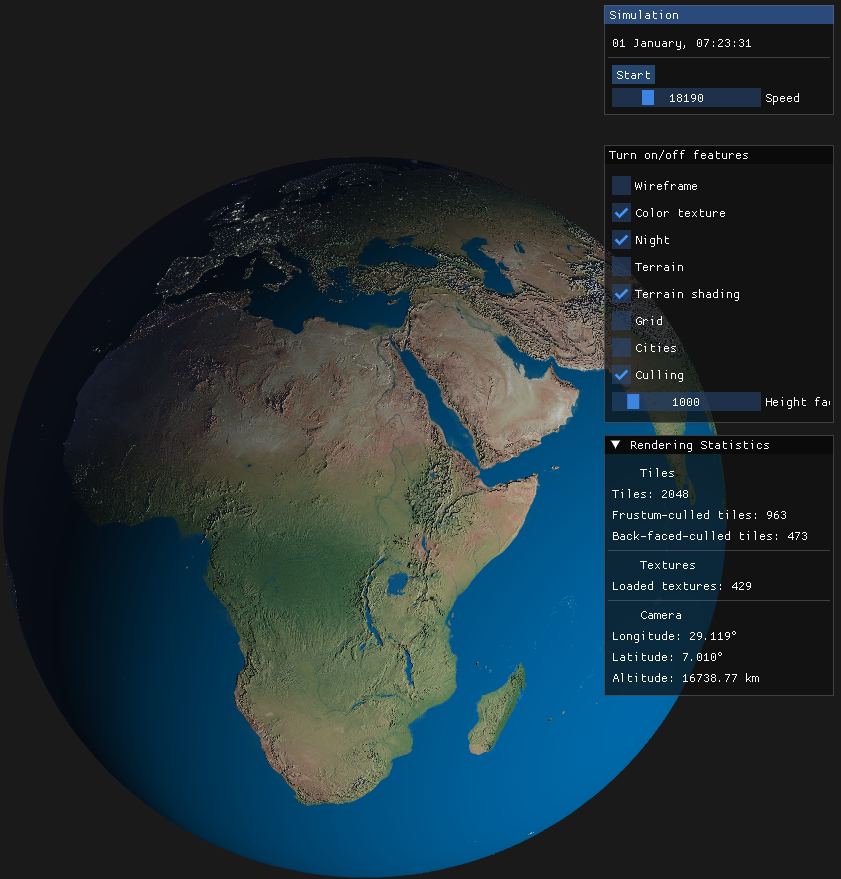
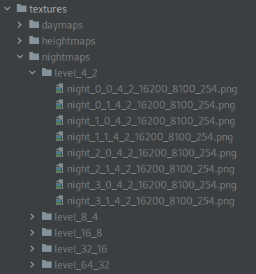
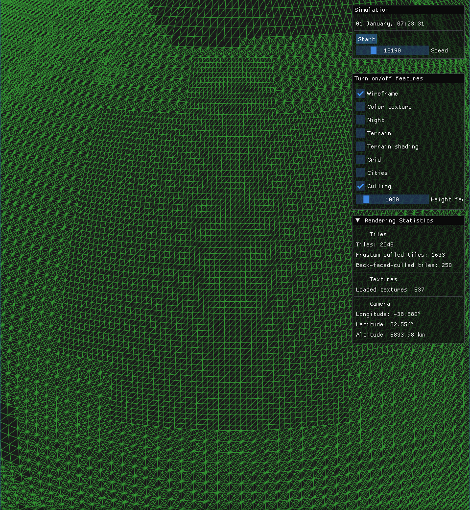
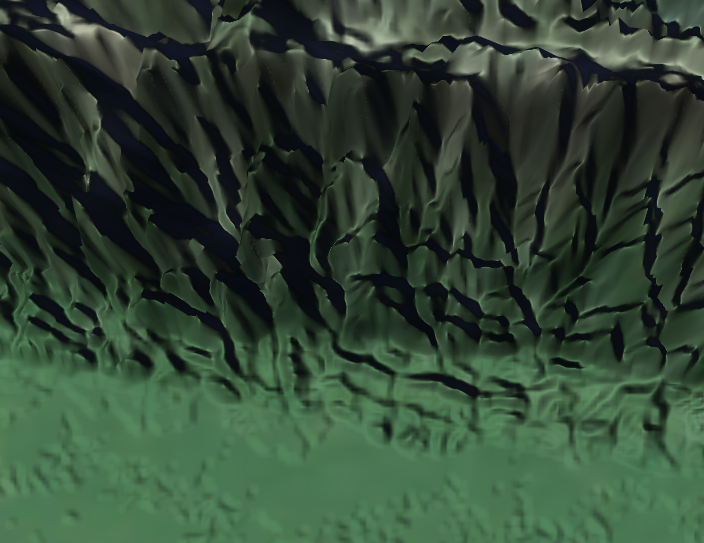
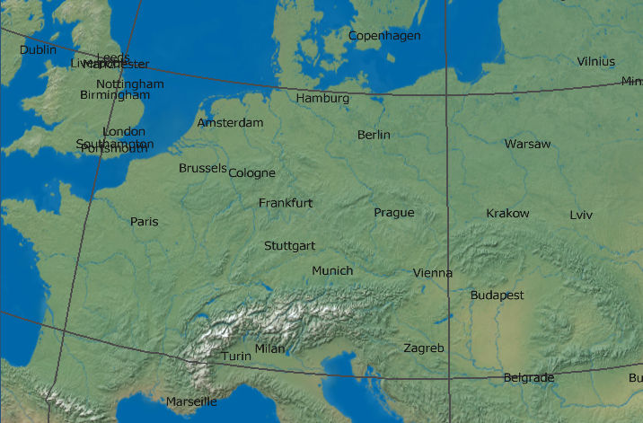

# Earth Rendering in OpenGL

The project is a 3D visualization of the Earth in OpenGL. 
It supports simulation of day and night cycles throught the year. 
It uses day and night textures. It can also highlight terrain and much more.

## Technologies

**Languages**:
* C++
* GLSL

**Libraries**:
- OpenGL
- GLFW3: Creating an OpenGL window application
- OpenGL Mathematics (GLM): Mathematical calculations for OpenGL
- ImGUI: Creating GUI elements

## Controls

* Motion
  *  Movement around the globe
    * Dragging (holding the left mouse button)
    * Keys "W", "A", "S", "D"
  * Zoom in and out
    * Mouse wheel
    * "+" and "-" keys
* Simulation control
  * The application menu offers to start and stop the simulation with the "Start" and "Stop" buttons.
  * The simulation speed can be set. Speed means the factor by which the simulation runs faster than the actual time.
* Switching elements on and off
  * In the GUI of the application, various display elements such as terrain, day/night transition, grid, etc. can be turned on or off.

## How to run

1. Set up the environment with the dependencies as required by CMake (see CMakeLists.txt).
2. Prepare the textures.

Run the following commands to generate the tiled textures in multiple Levels-of-Detail:

* `python3 tile_generator.py textures/5_night_16k.jpg textures/nightmaps night --max-level 5`
* `python3 tile_generator.py textures/2_no_clouds_16k.jpg textures/daymaps day --max-level 5`
* `

3. Build and run.

## Main features

The main features of the application are described below.

### Simulation

The application simulations rotation of the Earth along its own axis and simultaneous rotation around
the Sun. The Earth's tilt is also taken into account. The simulation starts on January 1 of no specific year.
Equinoxes and solstices happen at slightly different time every year. We approximate this by setting
a concrete date.

### Tiling

The first implemented **naive solution**: The initial solution was a single mesh representing the Earth, 
with one large texture applied to it. The textures are stored compressed on disk. When a texture is loaded, 
the entire size of the texture is loaded into memory. In this case, the textures take up units of GiB.

**Tiling**: A typical approach to solve the above mentioned problem is tiling. In this case, the entire mesh 
is divided into a fixed number of tiles. Similarly, textures must be divided into tiles large enough to cover
one or more tiles. When the tiles are rendered, the corresponding resources are loaded from memory.

The following image shows both the effect of tiling and tesselation on the geometry:

**Asynchronous resource loading**: loading resources is time consuming. Loading in the main thread would 
cause an unresponsive application. Thus, I implemented resource loading asynchronously in a side thread.
Communication between threads is done using shared queues, which they access with exclusive access. The main
thread makes requests to fetch resources and the fetching thread loads them into memory. The result is 
a responsive application.

### Culling

The main render cycle iterates over tiles. Before rendering, it checks if the resources for that tile are
loaded. A large number of tiles lie on the Earth's surface away from the camera, or outside the camera's 
frustum. Loading resources and rendering these tiles would be a waste of resources. It is important that 
this culling is done on the CPU before the actual rendering. In the case of culling in the OpenGL render chain,
the triangles would be discarded before the actual rasterization, and the vertex shaders and tessellation 
shaders would be unnecessarily executed and textures would be loaded for them.

### Level of Detail (LoD)

Using resources efficiently requires displaying only the necessary details. At greater distances from Earth, 
only coarser meshes and textures can be displayed. To this end, several levels of detail are predefined, both 
for the polygon mesh for the tiling and for the textures.

**Determination of LoD**: the level of detail is determined based on the computed error on the screen for a given
tile. The error is calculated based on distance from the camera, mesh granularity, field of view angle, and 
screen width. As the distance increases, the error of each level of detail decreases, allowing coarser levels 
to be displayed and vice versa.

**Splitting textures into levels**: Textures are physically stored on disk at different levels of detail. Each
texture is the same size, but covers a smaller or larger portion of the Earth depending on the level of detail.
At the highest level of detail, it covers only a small portion of the surface.

**Dealing with texture loading delays**: three texture types are used in the project: day, night and height map.
If any of the textures for the current LOD level are not yet loaded from disk, textures from other LODs are used. 
When zooming in, the texture from the coarser level is typically used, and when zooming out, the texture from the
finer level is used.

### Terrain rendering

The terrain is displayed using an elevation map. The elevation map is used for three different purposes:
1. The polygon mesh is tessellated in tessellation shaders. Tessellation factors are determined by the magnitude 
of the gradient (change in elevation) in a given triangle.
2. In tessellation evaluation shader, displacement mapping technique is used where the height of each vertex is 
modified according to the height in the height map.   
3. In the fragment shader, normal mapping technique is used to combine the normals of the original surface and the 
computed normals from the height map. Adjusting the normals depending on the surface is important for proper diffuse
shading.

### Cities rendering

Cities are being rendered on the surface of the Earth. There are 45k cities in total. City labels
are displayed using a function of their population and distance of the camera from the surface.
The function is expontial. It cannot be linear since there are a few large cities, but many small ones.

